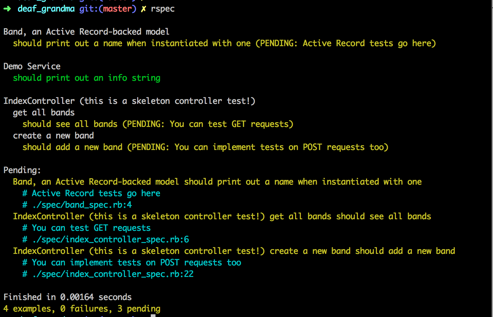

# Deaf Sinatra 1 Synchronous Forms

## Learning Competencies

* Read a foreign code base and be able to contribute code review and changes
* Map the flow of data through a web application
* Use URL parameters to pass data into a server application
* Use form controls to pass data into a server application
* Use ruby flow control to change server response
* Use redirect and render and know when to use each

## Summary

We're going to build our first and very simple web application using
[Sinatra][], a lightweight framework for building web
applications in Ruby.

This challenge is basically a web version of Deaf Grandma.

## Releases

### Release 0: Download the Skeleton Code

Use the skeleton code provided in `source/deaf_grandma`.  Change into that
directory and run `bundle` to install the necessary gems.  Note that this
application uses Postgres for its database, not SQLite.  If there's a
database-related error at any point grab a staff member to make sure the
machine is configured correctly and Postgres is running.

Establish databases required by the skeleton: `rake db:create` and `rake
db:migrate` as well as `rake db:test:prepare`.  We won't actually use the
database or ActiveRecord backed models in this challenge, but we will for
pretty much every other challenge so we might as well get used to typing these
words now :).

To launch the web application this command from the application root directory:

```text
$ shotgun config.ru
```

Sinatra, like Rails, is a [Rack-based](http://rack.github.com/) framework,
which means the main point of entry is this `config.ru` file.  The `ru` stands
for "rackup."

You should now be able to visit your web app at
[http://localhost:9393](http://localhost:9393).  `localhost` always refers to
"the current machine," so you actually have a tiny web server running on your
own computer!

It should look like this:

<p style="text-align: center"></p>

If it looks different call a staff member over!

### Release 1: Make Grandma Talk

First, visit
[http://localhost:9393/?grandma=hey!](http://localhost:9393/?grandma=hey!).
Notice how the value of the URL parameter `grandma` is rendered on the page.
Try to find where in the code this logic exists.  How do we extract information
from the URL parameters?

The string after a URL that looks like `?param1=value1&param2=value2` is called
a **query string**, and it contains the parameters of the request.

Load up the web app, type something into the talk-to-Grandma box, and click
"Say it!"  What happens and why?

### Release 2:  Make Grandma Logical

Finally, change `app/controllers/index.rb` so that Grandma response
appropriately.  If you typed in something in ALL CAPS make her respond
humorously.  If you typed in something else make her response with "Speak up,
kiddo!"

Read the [Sinatra documentation][] on [browser redirect][] and the [handlers
section][] of the [Sinatra Book][].  You'll want to redirect back to
`http://localhost:9292/?grandma=foobar` after the user submits their form.

### Release 3: Controller Testing

Now let's add a few tests to your application.  Look at the `spec/index_controller_spec.rb` file to see a sample `get` and `post` test.  You should be able to run `rspec` now to verify these test pass.



Your challenge is to add a **controller** spec which verifies
that when you submit a lower-cased string that your application returns your
humorous response.  If you want, add more tests to the get or post contexts.

Controller tests are one of the most heavily-used parts of
the Rails framework and it's important that you understand how to test them.


### Submit your code!

Create a pull request with the completed work from your branch.

## Resources

* [Sinatra Online Documentation][Sinatra] (_less-comprehensive but direct_)
* [Sinatra Book][Sinatra Book] (_more comprehensive, but less direct_)
* [Sinatra Testing][sinatra-testing]

[Sinatra documentation]: http://www.sinatrarb.com/intro
[browser redirect]: http://www.sinatrarb.com/intro#Browser%20Redirect
[handlers section]: http://sinatra-book.gittr.com/#handlers
[Sinatra Book]: http://sinatra-book.gittr.com/
[Sinatra]: http://www.sinatrarb.com/
[sinatra-testing]:http://www.sinatrarb.com/testing.html

